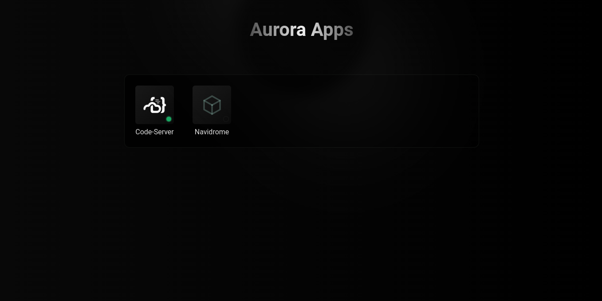

<h1 align="center">Aurora.apps</h1>

<p align="center">A simple web interface for start/paused Docker Compose containers.</p>

### Requirements
- [Node.js](https://nodejs.org/en/download/)
- [Docker](https://docs.docker.com/get-docker/)
- [Docker Compose](https://docs.docker.com/compose/install/)

## Getting Started

Follow these steps to get the project running on your local machine:

1. Clone this project
```bash
git clone https://github.com/lucasfernandodev/aurora.apps
cd aurora.apps
```

2. Create a directory to store your docker-compose files.
```bash
mkdir -p /opt/compose
```

4. In the folder where you chose to place the Docker Compose files, create a new folder with the name of the application.
Example:
```bash
mkdir -p /opt/compose/new-application
```

5. Inside your application's folder, add your `docker-compose.yml` file.
> 
> Remember that the only thing the application does is start/pause the container. Do the rest manually.
> 


4. Build docker image:
```bash
docker-compose build
```

5. Next, run the container:
```bash
docker-compose up -d
```

## Configuration

If you want to open a web interface when clicking on the application, add your app's URL inside the `config.json` file.
Example:
```JSON
  {
    "url": "https://code-server.aurora.apps"
  }
```

## How to Use

Once everything is set up, access the web interface at `http://localhost:7777`. From there, you can easily start or stop any container by right-clicking on the icon and selecting the corresponding option.




## Roadmap
- Removing alerts in front-end

## References

Icons are downloaded from [Dashboard Icons](https://github.com/walkxcode/dashboard-icons?tab=readme-ov-file#-icons).

- Docker Compose manager package -> https://github.com/PDMLab/docker-compose;
- Color contrast checker -> https://colorffy.com/contrast-checker?colors=000000-18a861
- Positioning context menu -> https://mionskowski.pl/posts/positioning-a-context-menu-using-pure-css/
- Custom elements in Javascript -> https://javascript.info/custom-elements
- Service workers  -> https://web.dev/articles/offline-cookbook?hl=pt-br#stale-while-revalidate
https://stackoverflow.com/questions/39363959/javascript-service-worker-fetch-resource-from-cache-but-also-update-it?rq=4
https://developer.chrome.com/docs/workbox/caching-strategies-overview?hl=pt-br